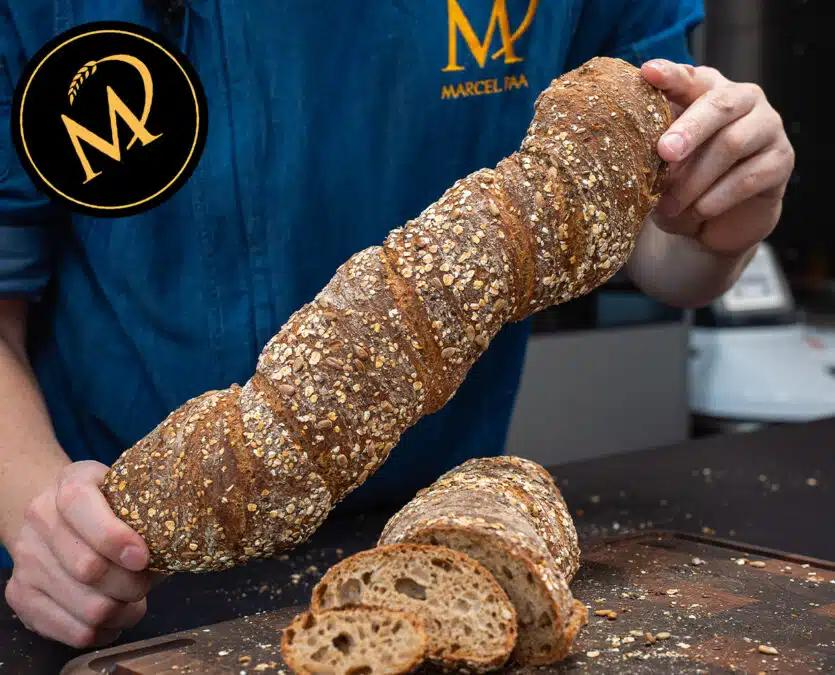

A crunchy, seeded twisted loaf that uses a long room-temperature bulk fermentation and an air-dry crusting method so the crust stays crisp while the crumb stays soft.

> **Storage**: Store cooled loaves in a cloth bag for 3-4 days or freeze wrapped for up to 2 months.

#### Ingredients
- 80-100 g mixed seeds (oats, flax, sunflower, sesame)
- 50 g rye wholemeal flour
- 1 g fresh yeast
- 11 g salt
- 450 g Ruch flour (Type 1050)
- 3 g roasted malt (optional)
- 400 g cold water
- Additional seed mix for coating

#### Method
1. Mix the seeds, flours, yeast, salt, optional malt, and most of the water in a mixer for 2-3 minutes, then add water gradually while kneading 10 minutes at medium speed until the dough passes the windowpane test.
2. Let the very soft dough ferment overnight at room temperature (12-16 hours) in a covered bowl; the long rest builds flavor and structure.
3. Dust the board with rye flour and seeds, turn out the dough, divide into two pieces, and gently twist each piece along its length so the seeds coat the surface.
4. Let the shaped loaves rest 30-40 minutes while you preheat the oven to 250°C with a baking steel, then bake with steam, reduce to 220°C, and bake 40-45 minutes, opening briefly after 10-20 minutes to vent.
5. Cool the rolled loaves on a wire rack so the crust crisps fully before slicing.

> **Tip:** A baking steel and a quick steam burst help the crust blister—the venting after 10-20 minutes keeps it from becoming soggy.

Special equipment: a baking steel/stone and a well-vented oven encourage the long, crisp crust this bread needs.
