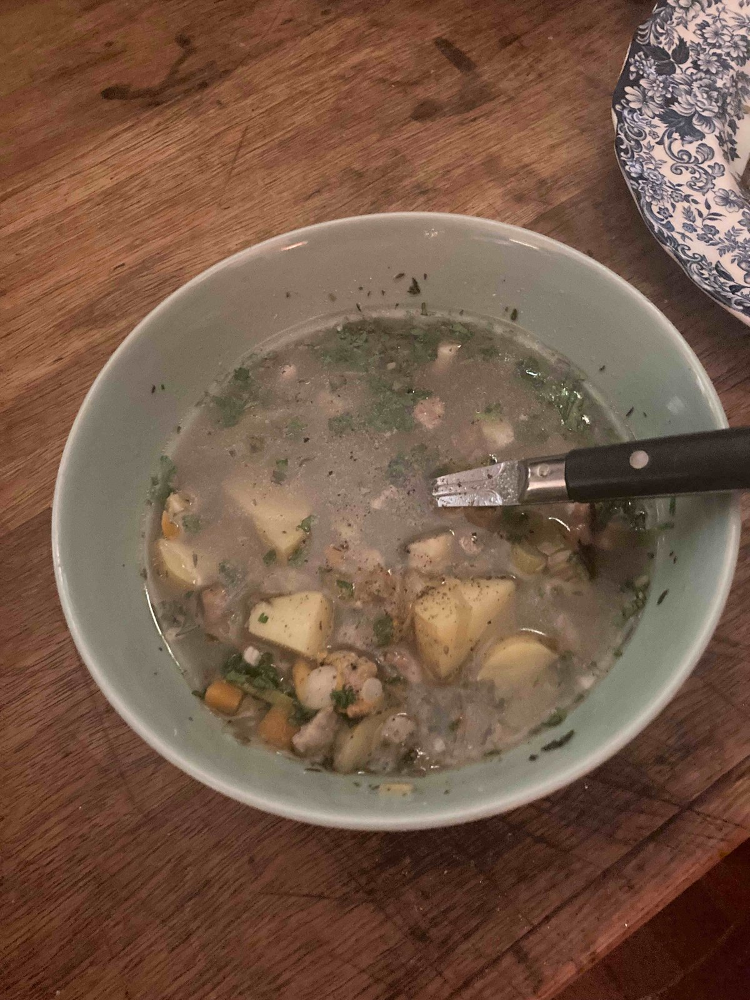

Creamy mussel, clam and potato stew inspired by the Rhode Island recipe. The saffron-yellow broth hides a gentle hit of smoke from the clams.

> Source: [Serious Eats—dairy-free Rhode Island clam chowder](https://www.seriouseats.com/dairy-free-rhode-island-clam-chowder-recipe)

#### Ingredients
- 1 kg mussels and clams, scrubbed
- 2 potatoes, diced
- 1 onion, diced
- 2 stalks celery
- 1 bay leaf
- 2 cups vegetable stock
- Cream or coconut milk to finish

#### Method
1. Sweat onion, celery, and potatoes in butter until soft.
2. Add stock, bay leaf, clams, and cook until the shells open, then stir in cream.
3. Remove shells, season with sea salt and finish with chopped parsley.

> Serve with thick crusty bread and a drizzle of olive oil.
